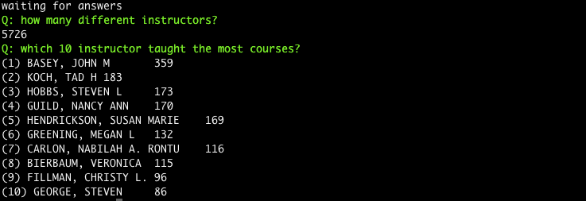

CU-Boulder FCQ Data
===

We will be doing analysis on CU-Boulder's public FCQ dataset.  The data is in .csv format.

# Setup

1. Install the packages: `npm install`
2. Import the data: `gulp import`

# Run

ask all questions

	node app.js

ask questions about instructors (i.e., questions containing the word 'instructor')

	node app.js instructor

and you should see this in the terminal

# Debug

run all questions and see all the debug messages

	DEBUG=* node app.js

run all questions and see only the debug messages associted with doubleshow's code for answering questions

	DEBUG=diff.questions.doubleshow node app.js

